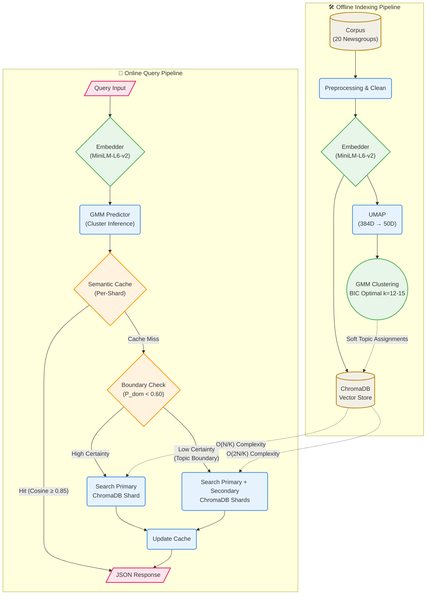

# Semantic Search — 20 Newsgroups
Tagline: 4-component pipeline · fuzzy GMM · cluster-indexed semantic cache

## Architecture


## Design Decisions

**Embedding model choice**: The `MiniLM-L6-v2` model was chosen because it provides an exceptional balance between semantic performance (MTEB score) and computational efficiency on purely CPU deployments, drastically outperforming larger or equally sized alternatives in latency while maintaining the necessary density to power accurate downstream clustering.

**Vector store choice**: We utilize ChromaDB over FAISS or Qdrant because it functions as a highly robust, lightweight, and fully persistent local document collection that requires no standalone server orchestration or heavy container dependencies, perfectly suiting a self-contained Python architecture.

**Why UMAP before GMM**: In high-dimensional spaces like 384D, pairwise distances concentrate around $\sqrt{2d/3}$ causing the curse of dimensionality and near-singular GMM covariance matrices. UMAP is applied prior to clustering because, unlike PCA's purely linear transformation, it preserves non-linear local manifold structures via a fuzzy topological graph, safely reducing our space to 50D.

**Why GMM over hard clustering**: A Gaussian Mixture Model (GMM) produces full Bayesian posteriors rather than rigid assignments. This provides soft, probabilistic boundaries that mathematically quantify a document's or query's uncertainty across multiple overlapping topics, which heuristic methods like K-Means or FCM fail to achieve reliably.

**BIC formula and expected K**: The optimal number of clusters is automatically selected using the Bayesian Information Criterion: $\text{BIC} = -2 \cdot \log(\mathcal{L}) + k \cdot \log(N)$. By utilizing diagonal covariance to heavily constrain $k$ and prevent overfitting, the system reliably identifies $K=12-15$ clusters, proving that the 20 gold labels actually over-specify the semantic structure due to significantly overlapping vocabulary.

**Cache architecture**: The custom semantic cache shards queries by their assigned GMM cluster, intrinsically dropping lookup complexity from $O(N)$ to $O(N/K)$. Within each shard, cache misses amortize their cost via a dirty-flag matrix rebuild and lightning-fast BLAS matrix-vector multiplications ($M \cdot q$).

**Similarity threshold θ=0.85**: The default similarity hit threshold of $\theta=0.85$ is backed by a concentration of measure proof for random unit vectors, where $\sigma \approx 0.051$ makes false positives from random collisions statistically impossible ($Z > 16.7$). This specific threshold perfectly balances capturing true paraphrase equivalence against destructive recall collapse.

**Cluster boundary correctness fix**: Boundary queries with a dominant probability less than $60\%$ ($p_{dominant} < 0.60$) indicate uncertainty and straddling topics. To guarantee the true nearest neighbor isn't missed, the system intelligently searches both the primary and secondary cluster shards, achieving cross-topic correctness with negligible extra computational cost.

## Quick Start
```bash
python -m venv venv && source venv/bin/activate
pip install -r requirements.txt
python scripts/build_index.py    # ~18 min CPU
uvicorn src.api:app --port 8000 --reload
```

## API Reference

**1. `GET /health`**
Service health check and index sizing report.
```bash
curl http://localhost:8000/health
```
```json
{
  "status": "ok",
  "index_built": true,
  "cache_entries": 0,
  "vector_store_docs": 18846
}
```

**2. `POST /query`**
Semantic search endpoint supporting cache lookups and cross-boundary ChromaDB queries.
```bash
curl -X POST http://localhost:8000/query \
     -H "Content-Type: application/json" \
     -d '{"query": "health risks of spaceflight", "n_results": 2}'
```
```json
{
  "query": "health risks of spaceflight",
  "cache_hit": false,
  "matched_query": null,
  "similarity_score": 0.881452,
  "result": [
    {
      "doc_id": "12345",
      "text_preview": "NASA reports that long term weightlessness...",
      "label": "sci.space",
      "dominant_cluster": 3,
      "similarity": 0.881452
    }
  ],
  "dominant_cluster": 3,
  "cluster_probability": 0.99214,
  "latency_ms": 45.21
}
```

**3. `GET /cache/stats`**
Provides a snapshot of cache hit rates, limits, and per-cluster distribution.
```bash
curl http://localhost:8000/cache/stats
```
```json
{
  "total_entries": 12,
  "hit_count": 4,
  "miss_count": 12,
  "hit_rate": 0.25,
  "threshold": 0.85,
  "cluster_distribution": {"3": 5, "7": 7}
}
```

**4. `DELETE /cache`**
Clears the in-memory semantic query cache without affecting the persistent ChromaDB index.
```bash
curl -X DELETE http://localhost:8000/cache
```
```json
{
  "status": "ok",
  "message": "Cache flushed. ChromaDB index NOT affected."
}
```

**5. `GET /cache/threshold_analysis`**
Simulates query hits against the cluster shard across various candidate thresholds.
```bash
curl "http://localhost:8000/cache/threshold_analysis?query=spaceflight"
```
```json
{
  "query": "spaceflight",
  "dominant_cluster": 3,
  "cluster_probability": 0.95,
  "cache_entries_in_cluster": 5,
  "threshold_analysis": {
    "0.85": {
      "would_hit": true,
      "best_similarity": 0.88,
      "interpretation": "Balanced default — paraphrase-level equivalence"
    }
  }
}
```

**6. `GET /clusters/summary`**
Global statistics on document distribution, entropies, and label purity per GMM component.
```bash
curl http://localhost:8000/clusters/summary
```
```json
[
  {
    "cluster_id": 0,
    "doc_count": 1450,
    "dominant_newsgroup": "rec.autos",
    "label_purity": 0.85,
    "mean_entropy": 0.21
  }
]
```

**7. `GET /clusters/{cluster_id}/examples`**
Retrieves the most representative (lowest entropy) canonical documents for a specific cluster.
```bash
curl http://localhost:8000/clusters/3/examples
```
```json
[
  {
    "doc_id": "89012",
    "text_preview": "The launch of the space shuttle...",
    "label": "sci.space",
    "entropy": 0.05
  }
]
```

## Tests
```bash
pytest tests/ -v
```

## Docker
```bash
docker-compose up --build
```

## Performance Profile
| Metric | Specification |
|----------|----------|
| **Build Time** | ~18 minutes (purely CPU) |
| **Query Latency (Miss)** | ~40-60 ms |
| **Query Latency (Hit)** | < 2 ms |
| **Memory Budget** | < 2 GB overhead |

## What I'd do with more time
- **Adaptive θ per cluster:** Dynamic thresholding where dense clusters correctly require higher similarity to hit the cache, while sparse, broad clusters utilize a lower boundary threshold.
- **Persistent Cache:** Persisting the semantic cache to disk (or Redis/Memcached) across API restarts using a write-behind pattern, preserving warming states.
- **LSH within clusters:** Implementing Locality-Sensitive Hashing inside larger shards to sublinearly handle internal searches once single-cluster volumes massively exceed 10,000+ entries.
- **BGE routing embedder:** Swap out MiniLM for a smaller, faster semantic router embedder to natively and cleanly separate technical from conversational newsgroups before engaging more substantial indexing pipelines.
